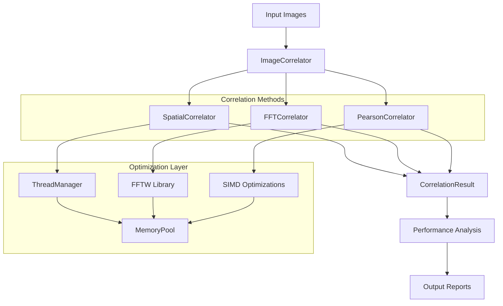
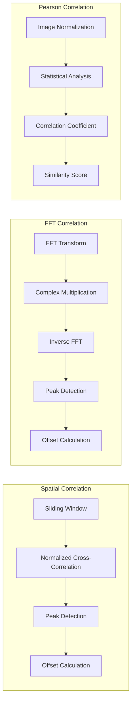
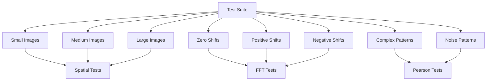
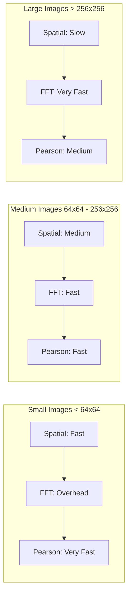

# ImgReg - Image Registration Framework

A C++ framework for image registration and correlation using multiple algorithms with testing and benchmarking capabilities.

## Overview

ImgReg implements three correlation methods for image registration and similarity analysis:

1. **Spatial Correlation** - Template matching using sliding window approach with normalized cross-correlation
2. **FFT Correlation** - Frequency domain correlation using FFTW3 library
3. **Pearson Correlation** - Statistical correlation using Pearson coefficient for similarity measurement

The framework includes:
- Multi-threading support with thread pools
- SIMD optimizations (AVX2/AVX-512)
- Memory pool management for reduced allocation overhead
- Testing suite with synthetic image generation
- Performance analysis and benchmarking
- Performance monitoring

## Architecture



## Method Comparison



## Features

### Performance Optimizations
- **SIMD Instructions**: Vectorized operations using AVX2/AVX-512
- **Branch-Free Algorithms**: Minimizes branch misprediction penalties
- **Memory Pooling**: Reduces allocation/deallocation overhead
- **Thread-Local Storage**: Minimizes synchronization overhead
- **Cache-Friendly Access**: Optimized memory access patterns

### Correlation Methods

#### Spatial Correlation
- **Algorithm**: Normalized cross-correlation with sliding window
- **Complexity**: O(n²m²) for n×n template on m×m image
- **Best For**: Small to medium images, precise alignment
- **Threading**: Parallelizable
- **Output**: Spatial offset (x, y) coordinates

#### FFT Correlation
- **Algorithm**: Frequency domain correlation using FFT
- **Complexity**: O(n² log n)
- **Best For**: Large images, global alignment
- **Threading**: Limited by FFTW's internal parallelization
- **Output**: Spatial offset (x, y) coordinates

#### Pearson Correlation
- **Algorithm**: Statistical correlation coefficient
- **Complexity**: O(n²)
- **Best For**: Similarity measurement, statistical analysis
- **Threading**: Can parallelize mean/std calculations
- **Output**: Correlation coefficient (-1 to 1)

## Build Requirements

### Dependencies
- **C++17** compatible compiler (GCC 7+, Clang 5+, MSVC 2017+)
- **CMake** 3.16 or higher
- **OpenCV** 4.0 or higher
- **FFTW3** library
- **OpenMP** (optional, for additional threading support)

### System Requirements
- **CPU**: x86_64 with AVX2 support
- **Memory**: 4GB minimum, 16GB for large images
- **OS**: Linux, macOS, Windows (WSL2 supported)

## Installation

### Ubuntu/Debian
```bash
# Install dependencies
sudo apt update
sudo apt install build-essential cmake libopencv-dev libfftw3-dev libomp-dev

# Clone and build
git clone https://github.com/Ether-G/imgreg.git
cd imgreg
mkdir build && cd build
cmake ..
make -j$(nproc)
```

### macOS
```bash
# Install dependencies using Homebrew
brew install cmake opencv fftw libomp

# Clone and build
git clone https://github.com/Ether-G/imgreg.git
cd imgreg
mkdir build && cd build
cmake ..
make -j$(sysctl -n hw.ncpu)
```

### Windows (WSL2)
```bash
# Follow Ubuntu instructions above
# Or use Visual Studio with CMake integration
```

## Usage

### Basic Usage

```bash
# Single image correlation
./imgreg -i image1.jpg -j image2.jpg -m all

# Specific method with custom thread count
./imgreg -i image1.jpg -j image2.jpg -m fft -t 8 -v

# Generate synthetic test images
./generate_shifted 64 64 5 3 0 1
```

### Command Line Options

| Option | Description | Default |
|--------|-------------|---------|
| `-h, --help` | Show help message | - |
| `-i, --image-a <file>` | First image file | - |
| `-j, --image-b <file>` | Second image file | - |
| `-m, --method <method>` | Correlation method (spatial, fft, pearson, all) | all |
| `-t, --threads <num>` | Number of threads | auto-detect |
| `-v, --verbose` | Enable verbose output | false |

### Examples

#### Single Image Correlation
```bash
# Compare two images using all methods
./imgreg -i camera1.jpg -j camera2.jpg -m all -v

# Use only FFT method with 8 threads
./imgreg -i image_a.png -j image_b.png -m fft -t 8

# Pearson correlation for similarity analysis
./imgreg -i pattern1.jpg -j pattern2.jpg -m pearson
```

#### Testing Suite
```bash
# Run comprehensive test suite
./test_comprehensive.sh

# Generate specific test images
./generate_shifted 128 128 10 8 1 0  # 128x128 circle with (10,8) shift
```

## Testing

The framework includes a testing suite that validates all correlation methods across various scenarios:

### Test Coverage
- **Image Sizes**: 16x16 to 160x160 pixels
- **Shift Patterns**: Positive, negative, and zero shifts
- **Image Patterns**: Boxes, circles, text, noise, complex patterns
- **Complexity Levels**: Simple to complex image structures

### Test Categories


### Running Tests
```bash
# Run all tests
cd build
./test_comprehensive.sh

# Expected output: 60 method executions (20 tests × 3 methods)
# - Spatial: Detects spatial offsets (pixel-level accuracy)
# - FFT: Detects spatial offsets (frequency domain analysis)
# - Pearson: Measures statistical correlation (similarity assessment)
```

## Performance

### Method Performance Characteristics



### Typical Performance Results
- **Spatial Correlation**: Suitable for small images, precise alignment
- **FFT Correlation**: Suitable for large images, generally faster
- **Pearson Correlation**: Fast for similarity measurement

## Output and Results

### Correlation Results
Each method returns a `CorrelationResult` containing:
- **Correlation Value**: Strength of correlation (0-1 for spatial/FFT, -1 to 1 for Pearson)
- **Offset Coordinates**: Spatial offset (x, y) for spatial and FFT methods
- **Execution Time**: Microsecond precision timing
- **Memory Usage**: Peak memory consumption
- **Method Name**: Identifier for the correlation method used

### Sample Output
```
Method: FFT
Correlation Value: 0.856789
Offset: (5, 3)
Execution Time: 45000 μs
Memory Usage: 33554432 bytes
Thread Count: 8
```

## Project Structure

```
imgreg/
├── CMakeLists.txt          # Main build configuration
├── include/                # Header files
│   ├── correlation_result.h
│   ├── fft_correlator.h
│   ├── image_correlator.h
│   ├── memory_pool.h
│   ├── pearson_correlator.h
│   ├── performance_analyzer.h
│   ├── spatial_correlator.h
│   └── thread_manager.h
├── src/                    # Source files
│   ├── fft_correlator.cpp
│   ├── generate_shifted.cpp
│   ├── image_correlator.cpp
│   ├── main.cpp
│   ├── memory_pool.cpp
│   ├── pearson_correlator.cpp
│   ├── performance_analyzer.cpp
│   ├── spatial_correlator.cpp
│   └── thread_manager.cpp
├── tests/                  # Test files
│   ├── CMakeLists.txt
│   └── test_main.cpp
├── data/                   # Test data directory
├── results/                # Output results directory
├── test_comprehensive.sh   # Comprehensive test suite
└── README.md              # This file
```

## Contributing

1. Fork the repository
2. Create a feature branch (`git checkout -b feature/amazing-feature`)
3. Commit your changes (`git commit -m 'Add amazing feature'`)
4. Push to the branch (`git push origin feature/amazing-feature`)
5. Open a Pull Request

## License

This project is licensed under the MIT License - see the LICENSE file for details.

## Acknowledgments

- **FFTW3**: Fast Fourier Transform library
- **OpenCV**: Computer vision library
- **SIMD**: Vectorization optimizations 